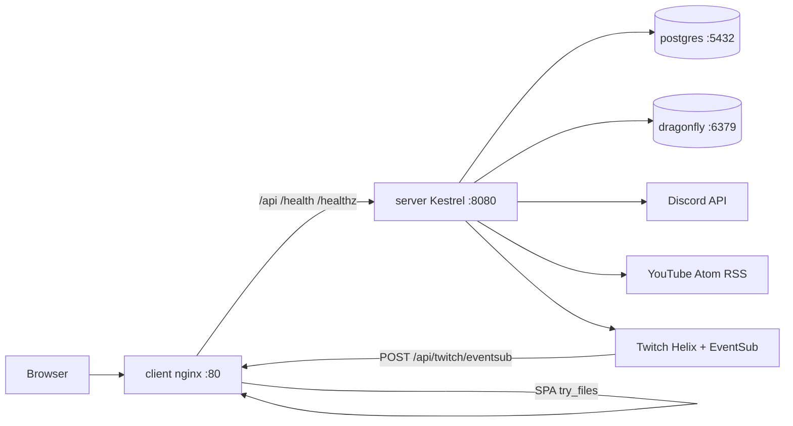

# Infrastructure

Four Compose services on network `hookio`. Secrets stay in host `env_file` files; images do not bake credentials.

**Run:** `docker compose up --build` then open `http://localhost`. Tests: `dotnet test server/server.sln` and `cd client && npm test && npm run build`.

## Topology

| Compose service | Image / build | Hostname | Published ports | Role |
| --- | --- | --- | --- | --- |
| `postgres` | `postgres:16.15` | `postgres` | `5432` (no host bind in compose — internal) | [[Hookio/Services/Postgres]] |
| `dragonfly` | `docker.dragonflydb.io/dragonflydb/dragonfly:v1.40.4` | `dragonfly` | `6379` (internal) | [[Hookio/Services/Dragonfly]] |
| `server` | build `server/` (`mcr.microsoft.com/dotnet/aspnet:10.0`) | `server` | `8080` (internal) | [[Hookio/Services/Hookio API]] |
| `client` | build `client/` (`nginx:1.30.4-alpine`) | `client` | **`80:80`** | [[Hookio/Services/Nginx]] |

Compose `ports: - 5432` (no host mapping) publishes a random host port. The SPA talks to the API via nginx `proxy_pass http://server:8080`, not via those published ports.

Startup order: postgres and dragonfly must be `service_healthy`, then the API (curl `http://127.0.0.1:8080/healthz`), then nginx.

Volumes: `postgres_data`, `dragonfly_data`.

## How pieces talk

- Browser → nginx `:80` for the Vite-built SPA (`try_files` → `index.html`).
- Browser `/api/*` → nginx → Kestrel `http://server:8080/api`.
- Browser `/health` and `/healthz` → same proxy to Kestrel ([[Hookio/Features/Health]]).
- Local Vite (`npm run dev`) proxies `/api` to `VITE_API_ADDRESS` (example `http://localhost:8080` if the API port is published, or `http://localhost:5093` for `dotnet run`). See `client/vite.config.ts`.
- Kestrel uses Npgsql to postgres and StackExchange.Redis to dragonfly.
- Outbound: Discord REST v10 ([[Hookio/Services/Discord]]), YouTube `feeds/videos.xml` ([[Hookio/Services/YouTube]]), Twitch Helix + EventSub ([[Hookio/Services/Twitch]]).

## TLS and EventSub

Twitch EventSub **requires a public HTTPS callback** on the webhook transport. Default nginx only `listen 80` so compose starts without certs.

- Production: mount certs and use `client/nginx.tls.conf.example` (`listen 443 ssl`). Do not publish `443:443` without certificates.
- Local: tunnel (cloudflared / ngrok) to host `:80` and set `TWITCH_EVENTSUB_CALLBACK_URL` to `https://…/api/twitch/eventsub`.

Cookie `Secure` is set when the request is HTTPS, or when `HOOKIO_COOKIE_SECURE=true`. See [[Hookio/Features/Auth]].

## Env files (names only)

| File | Used by |
| --- | --- |
| `.env.postgres` (from `.env.postgres.example`) | postgres container |
| `server/Hookio/.env.production` (from `server/Hookio/.env.example`) | API in compose |
| `server/Hookio/.env` | `dotnet run` via `DotEnv.Load` |
| `client/.env.production` (from `client/.env.example`) | SPA **build-time** Vite vars |

Never commit real values. Placeholders live in the `*.example` files.

### Server (`EnvNames`)

`PG_CONNECTION_STRING`, `REDIS_CONNECTION_STRING`, `JWT_SECRET`, `DISCORD_CLIENT_ID`, `DISCORD_CLIENT_SECRET`, `DISCORD_REDIRECT_URI`, `HOOKIO_COOKIE_SECURE`, `TWITCH_CLIENT_ID`, `TWITCH_CLIENT_SECRET`, `TWITCH_EVENTSUB_SECRET`, `TWITCH_EVENTSUB_CALLBACK_URL`.

Compose also sets `ASPNETCORE_HTTP_PORTS=8080`.

### Postgres

`POSTGRES_USER`, `POSTGRES_PASSWORD`, `POSTGRES_DB` — must match the connection string.

### Client (Vite)

`VITE_API_ADDRESS`, `VITE_DISCORD_LOGIN_URL` (authorize URL with `identify guilds email`). The Discord app’s redirect URI must match both `DISCORD_REDIRECT_URI` and the `redirect_uri` inside `VITE_DISCORD_LOGIN_URL`. The examples currently differ (`http://localhost/oauth` vs `http://localhost`); align them with the Discord developer portal.

## Git ignore

Single root `.gitignore` (no nested gitignores). It excludes env files (keeps `*.example`), Compose `stacks`, Node/Vite output (`node_modules/`, `dist/`), and all .NET build output (`bin/`, `obj/`, `Debug/`, `Release/`, `*.dll` / `*.pdb` / `*.exe`, NuGet, test results). Do not commit those folders.

## Runtimes in repo

| Piece | Version in repo |
| --- | --- |
| ASP.NET / TFM | `net10.0` (JwtBearer / EF 10.0.10, Npgsql 10.0.3, Swashbuckle 10.2.3) |
| Node (client image + CI) | 24 |
| Vite | 6.4.3 |
| React | 18.3.1 |
| React Router | 7.18.2 |
| TypeScript | 5.9.3 |
| ESLint | 9.x flat config |
| StackExchange.Redis | 2.13.17 |

CI: [[Hookio/Services/GitHub Actions]]. Product constraints that survived the overhaul: [[Hookio/Decisions/Overhaul locked answers]].

## Official docs

- [Docker Compose](https://docs.docker.com/compose/)
- [ASP.NET Core](https://learn.microsoft.com/en-us/aspnet/core/introduction-to-aspnet-core)
- [.NET 10](https://learn.microsoft.com/en-us/dotnet/core/)
